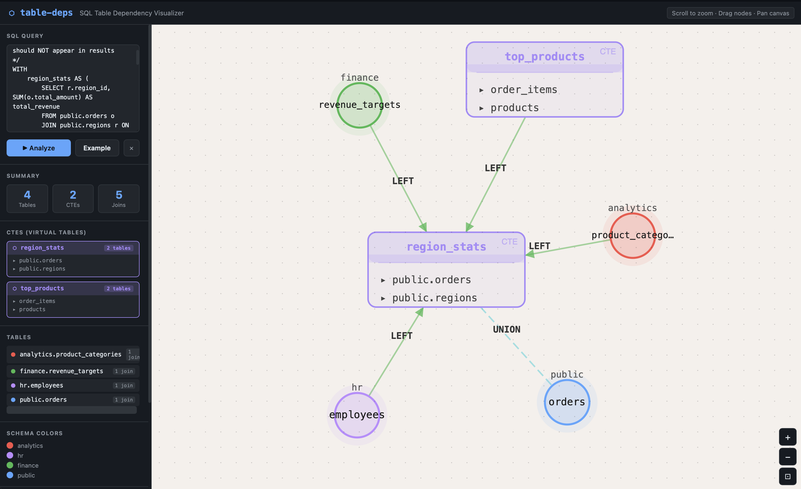

# table-deps

Extract SQL table dependencies and visualise them as interactive graphs — no database connection required.

---

## Why This Exists

Reading a complex SQL query and mentally mapping out which tables feed into which is harder than it sounds.

A real-world query often has 5–10 CTEs, a mix of `LEFT JOIN`, `INNER JOIN`, and `UNION ALL` branches, inline subqueries, and tables spread across multiple schemas. By the time you reach the final `SELECT`, it's easy to lose track of the full dependency chain.

This becomes a real problem when:

- **Planning a migration** — you need the exact order in which tables must be recreated or backfilled.
- **Onboarding to an unfamiliar codebase** — tracing what a query actually touches, without running it against a live database.
- **Refactoring or deprecating tables** — understanding what upstream queries will break before you change anything.
- **Reviewing someone else's SQL** — quickly building a mental model of a query you didn't write.

`table-deps` solves this by parsing SQL statically and rendering interactive dependency graphs — so you see the full picture in seconds instead of reading line by line.

---

## Quick Start

```bash
# Install
uv sync

# Visualise a single SQL query in the browser
uv run table-deps ui

# Visualise an entire project directory as a DAG
uv run table-deps project-ui test_projects/kimball_retail
```

---

## Features

| Area | Feature |
| --- | --- |
| **Parser** | Detects `FROM`, `JOIN`, `INTO`, `UPDATE`; strips CTE aliases; handles schema-qualified names, quoted identifiers, comments |
| **CLI** | Plain / JSON / CSV output; reads from inline SQL, file, or stdin |
| **SQL Visualizer** | Force-directed graph of a single query — CTEs as named boxes, join-type edge labels, UNION branches |
| **Project DAG** | Left-to-right DAG of an entire project directory — one node per `.sql` file, cross-file dependency edges |

---

## Requirements

- Python ≥ 3.11

## Installation

```bash
uv sync
```

With development dependencies (pytest, coverage):

```bash
uv sync --extra dev
```

---

## CLI Usage

```text
table-deps [SQL_OR_FILE] [--file] [--output-format {plain,json,csv}] [--verbose]
```

### Examples

```bash
# Inline SQL
table-deps "SELECT * FROM orders JOIN customers ON orders.customer_id = customers.id"

# From a file
table-deps --file query.sql

# From stdin
cat query.sql | table-deps

# JSON output
table-deps "SELECT * FROM orders JOIN customers ON orders.customer_id = customers.id" -o json

# CSV output
table-deps "SELECT * FROM orders JOIN customers ON orders.customer_id = customers.id" -o csv

# Debug logging
table-deps "SELECT * FROM orders" --verbose
```

---

## SQL Visualizer UI

Visualise the dependencies inside a **single SQL query** as an interactive force-directed graph:

```bash
uv run table-deps ui
```



### SQL Visualizer Features

- Force-directed graph — nodes are draggable, canvas is zoomable and pannable
- Schema-based colour coding (`public`, `analytics`, `hr`, `finance`, …)
- **CTE boxes** — each CTE rendered as a named box listing its internal tables
- Edge arrows show data flow direction; edge labels show JOIN type (INNER, LEFT, RIGHT, FULL, CROSS)
- **UNION / UNION ALL** branches connected by dashed cyan edges
- Sidebar: table list, CTE list, stats, schema legend, join-type legend
- **★ Example** button — loads a built-in complex query instantly
- `Ctrl+Enter` / `Cmd+Enter` to re-analyse

### Example Queries

The `ui_examples/` folder contains four ready-to-paste queries:

| File | Domain | Schemas |
| --- | --- | --- |
| `ecommerce_orders.sql` | E-commerce order fulfilment | `public`, `inventory`, `payments`, `shipping`, `analytics` |
| `hr_payroll.sql` | HR payroll & headcount | `hr`, `finance`, `compliance`, `org` |
| `analytics_funnel.sql` | Product analytics funnel | `events`, `users`, `product`, `marketing`, `billing` |
| `finance_reporting.sql` | Multi-entity P&L consolidation | `finance`, `gl`, `fx`, `audit`, `reporting` |

---

## Project DAG UI

Scan a directory of SQL files and visualise the **entire project's cross-file dependency graph**:

```bash
uv run table-deps project-ui /path/to/your/project
```

Files must follow the `schema.table_name.sql` naming convention. Each file becomes a node; the graph flows **left → right** by dependency level — source/raw tables on the left, reports and marts on the right.


### Project DAG Features

- **Left-to-right DAG layout** — topological levels computed automatically, no configuration needed
- **Dynamic schema colouring** — the schema prefix (everything before the first `.` in the filename) is used as the layer colour; works for any architecture (Medallion, Kimball, Data Vault, etc.)
- **CTE-style node boxes** — each node shows its schema header and dependency list; coloured dots distinguish internal project deps from external refs
- **Physics simulation** — nodes repel each other and bounce; drag a node and release to watch it spring back to its original position
- **Live edge stretching** — bezier edges redraw in real time while dragging
- **Double-click a node** → opens that file's SQL in the SQL Visualizer in a new tab, auto-analyzed
- **★ Example** button — loads the Kimball retail project instantly (no folder needed)
- Zoom · Pan · Fit-to-view · Reset layout controls
- Sidebar: project stats, table list sorted by DAG level, schema colour legend
- Works via CLI (hash injection) **or** browser folder picker / drag-and-drop

### Naming Convention

```text
schema.table_name.sql
│       │
│       └─ table name (underscores ok)
└─ schema / layer prefix  →  determines node colour
```

Examples: `raw.orders.sql`, `dim.customer.sql`, `fact.sales.sql`, `mart.revenue_summary.sql`

### Example Projects

Three example projects are included under `test_projects/`:

| Project | Architecture | Layers | Nodes | Edges |
| --- | --- | --- | --- | --- |
| `kimball_retail` | Kimball star schema | `src` → `dim` → `fact` → `rpt` | 15 | 28 |
| `forecast_monthly` | Medallion | `raw` → `staging` → `mart` → `gold` | 11 | 17 |
| `data_vault` | Data Vault 2.0 | `raw` → `hub`/`link`/`sat` → `bv` → `mart` | 19 | 35 |

```bash
uv run table-deps project-ui test_projects/kimball_retail
uv run table-deps project-ui test_projects/forecast_monthly
uv run table-deps project-ui test_projects/data_vault
```

---

## Python Library Usage

```python
from table_deps import extract_tables

sql = """
    WITH ranked AS (SELECT * FROM employees ORDER BY salary DESC)
    SELECT r.name, d.name
    FROM ranked r
    JOIN departments d ON r.dept_id = d.id
"""

tables = extract_tables(sql)
print(tables)  # ['departments', 'employees']
```

`extract_tables` raises `ValueError` for empty input and returns a sorted, deduplicated, lowercased list of table names with CTE aliases removed.

---

## Project Structure

```text
table_deps/
├── table_deps/              # Library package
│   ├── __init__.py          # Public API: extract_tables
│   ├── extractor.py         # Core regex parsing logic
│   ├── cli.py               # CLI — ui and project-ui subcommands
│   ├── project_scanner.py   # Directory scanner: builds cross-file dep graph
│   └── static/
│       ├── index.html             # SQL Visualizer (table-deps ui)
│       └── project_overview.html  # Project DAG UI (table-deps project-ui)
├── tests/
│   ├── test_extractor.py    # 36 parser tests
│   └── test_cli.py          # 8 CLI tests
├── ui_examples/             # Complex SQL queries for the SQL Visualizer
│   ├── ecommerce_orders.sql
│   ├── hr_payroll.sql
│   ├── analytics_funnel.sql
│   └── finance_reporting.sql
├── test_projects/           # Example multi-file projects for the Project DAG UI
│   ├── kimball_retail/      # Kimball star schema  (15 files)
│   ├── forecast_monthly/    # Medallion architecture (11 files)
│   └── data_vault/          # Data Vault 2.0 (19 files)
├── docs/
│   └── ui_screenshot.png
├── main.py                  # Backward-compatible entry point
└── pyproject.toml
```

---

## Running Tests

```bash
uv run pytest
```

With coverage:

```bash
uv run pytest --cov=table_deps --cov-report=term-missing
```

---

## Limitations

- Uses regex-based parsing, not a full SQL AST. Extremely unusual constructs (e.g. dynamic SQL in stored procedures) may not parse correctly.
- Does not resolve view definitions or follow cross-database references.
- Project DAG UI requires files named `schema.table.sql`; files not matching this pattern are skipped.
