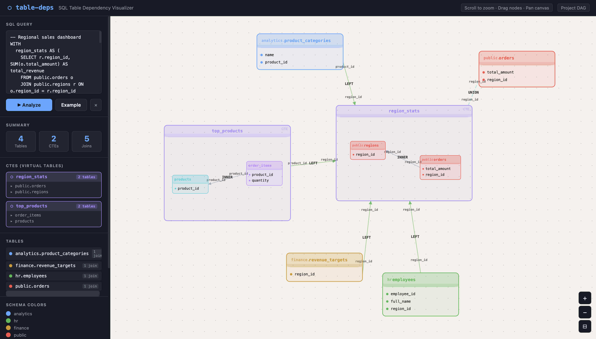
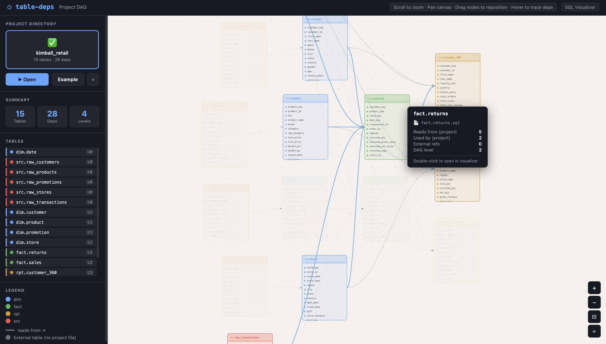
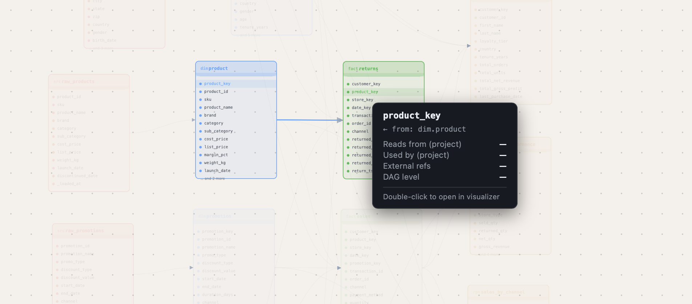
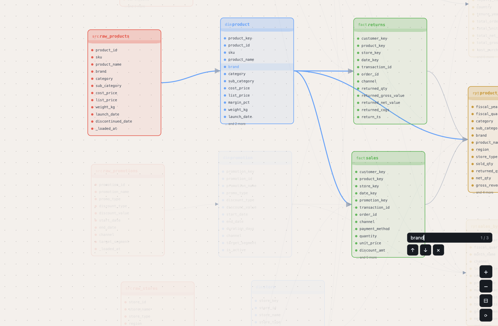

# table-deps

**Static SQL dependency analysis — no database required.**

[](https://www.python.org/)
[](LICENSE)
[](https://table-deps.vercel.app)

Extract table dependencies from SQL and explore them as interactive graphs.
Works on a single query or an entire project of `.sql` files.

[**Live Demo**](https://table-deps.vercel.app) · [SQL Visualizer](#sql-visualizer) · [Project DAG](#project-dag) · [CLI](#cli) · [Python Library](#python-library)

---

## The Problem

Reading a complex SQL query and mapping out which tables feed into which is harder than it sounds. A real-world query can have 5–10 CTEs, mixed JOIN types, inline subqueries, and tables across multiple schemas. This becomes painful when:

- **Migrating** — you need the exact order tables must be recreated or backfilled
- **Onboarding** — tracing what a query touches, without running it against a live database
- **Refactoring** — knowing what will break before you change anything
- **Code review** — quickly building a mental model of SQL you didn't write

`table-deps` solves this by parsing SQL statically and rendering interactive dependency graphs — so you see the full picture in seconds.

---

## Quick Start

**Try it instantly (no install)** → [table-deps.vercel.app](https://table-deps.vercel.app)

Or run locally:

```bash
# Install
uv sync

# Visualise a single SQL query
uv run table-deps ui

# Visualise an entire project directory as a DAG
uv run table-deps project-ui test_projects/kimball_retail
```

---

## SQL Visualizer

Paste any SQL query and explore it as an interactive force-directed graph. Each table becomes a node, each JOIN an edge.



```bash
uv run table-deps ui
```

### SQL Visualizer Features

- **Force-directed graph** — nodes are draggable; canvas is zoomable and pannable
- **Schema colour coding** — every schema gets a distinct colour, applied consistently across nodes and edges
- **Table boxes** — each table shows its `schema.` prefix, table name, and every column referenced in the query (SELECT, JOIN, WHERE, GROUP BY)
- **Column-level edge routing** — arrows exit from the exact column row used in the JOIN condition, making join keys immediately visible
- **CTE boxes** — each CTE rendered as a named container with its own mini force-directed graph; internal tables appear as draggable mini nodes connected by typed edges, with strong repulsion so nodes spread out clearly
- **Subquery support** — tables inside inline subqueries (`JOIN (...) alias`) expose their full SELECT column list
- **Edge labels** — show JOIN type (INNER, LEFT, RIGHT, FULL, CROSS); UNION branches shown as dashed cyan edges
- **Sidebar** — table list, CTE list, summary stats, schema legend, join-type legend
- **Example** button — loads a built-in multi-schema query instantly
- `Ctrl+Enter` / `Cmd+Enter` to re-analyse

### Example Queries

Four production-style queries are included in `ui_examples/`:

| File | Domain | Schemas |
| --- | --- | --- |
| `ecommerce_orders.sql` | E-commerce order fulfilment | `public`, `inventory`, `payments`, `shipping`, `analytics` |
| `hr_payroll.sql` | HR payroll & headcount | `hr`, `finance`, `compliance`, `org` |
| `analytics_funnel.sql` | Product analytics funnel | `events`, `users`, `product`, `marketing`, `billing` |
| `finance_reporting.sql` | Multi-entity P&L consolidation | `finance`, `gl`, `fx`, `audit`, `reporting` |

---

## Project DAG

Scan a folder of `.sql` files and visualise the **entire project's cross-file dependency graph** — one node per file, edges for every cross-file reference, laid out left-to-right by dependency level.





```bash
uv run table-deps project-ui /path/to/your/project
```

Files must follow the `schema.table_name.sql` naming convention. The schema prefix determines the node colour.

### Project DAG Features

- **Left-to-right DAG layout** — topological levels computed automatically; source/raw tables on the left, reports and marts on the right
- **Dynamic schema colouring** — any architecture works: Medallion, Kimball, Data Vault, custom layers
- **Node boxes** — each node shows its schema header, column list, and colour-coded dep/external-ref indicators
- **Column source tracing** — hover a column row to highlight which upstream table it originates from, with a connecting edge
- **Search** (`Ctrl+F` or `/`) — type any table or column name; fuzzy matches are highlighted with the same fading as hover; matching column rows are lit up inside each node; cycle through matches with `Enter` / `Shift+Enter` or the ↑ ↓ buttons; press `Esc` to clear
- **Double-click a node** — opens that file's SQL in the SQL Visualizer in a new tab, auto-analysed
- **Physics simulation** — drag nodes to explore; edges redraw live; release to let the layout spring back
- **Example** button — loads the Kimball retail project instantly (no folder needed)
- **Zoom controls** — zoom in/out, fit-to-view, reset layout; scroll to zoom graph only (sidebar stays fixed); resize sidebar with `[` / `]`
- **Sidebar** — project stats, table list sorted by DAG level, schema colour legend



### Naming Convention

```text
schema.table_name.sql
│       │
│       └── table name  (underscores OK)
└── schema / layer prefix  →  determines node colour
```

Examples: `raw.orders.sql`, `dim.customer.sql`, `fact.sales.sql`, `mart.revenue_summary.sql`

### Example Projects

Three example projects ship with the repo under `test_projects/`:

| Project | Architecture | Layers | Nodes | Edges |
| --- | --- | --- | --- | --- |
| `kimball_retail` | Kimball star schema | `src → dim → fact → rpt` | 15 | 28 |
| `forecast_monthly` | Medallion | `raw → staging → mart → gold` | 11 | 17 |
| `data_vault` | Data Vault 2.0 | `raw → hub/link/sat → bv → mart` | 19 | 35 |

```bash
uv run table-deps project-ui test_projects/kimball_retail
uv run table-deps project-ui test_projects/forecast_monthly
uv run table-deps project-ui test_projects/data_vault
```

---

## CLI

Extract dependencies from the command line — no browser needed.

```bash
table-deps [SQL_OR_FILE] [--file] [--output-format {plain,json,csv}] [--verbose]
```

```bash
# Inline SQL
table-deps "SELECT * FROM orders JOIN customers ON orders.customer_id = customers.id"

# From a file
table-deps --file query.sql

# From stdin
cat query.sql | table-deps

# JSON output
table-deps --file query.sql -o json

# CSV output
table-deps --file query.sql -o csv

# Debug logging
table-deps "SELECT * FROM orders" --verbose
```

---

## Python Library

```python
from table_deps import extract_tables

sql = """
    WITH ranked AS (SELECT * FROM employees ORDER BY salary DESC)
    SELECT r.name, d.name
    FROM ranked r
    JOIN departments d ON r.dept_id = d.id
"""

tables = extract_tables(sql)
print(tables)  # ['departments', 'employees']
```

`extract_tables` raises `ValueError` for empty input and returns a sorted, deduplicated, lowercased list — CTE aliases are automatically excluded.

---

## Installation

Requires Python ≥ 3.11.

```bash
# Runtime only
uv sync

# With dev dependencies (pytest, coverage)
uv sync --extra dev
```

---

## Running Tests

```bash
uv run pytest

# With coverage
uv run pytest --cov=table_deps --cov-report=term-missing
```

44 tests, ~0.05 s.

---

## Project Structure

```text
table_deps/
├── table_deps/                  # Library package
│   ├── __init__.py              # Public API: extract_tables
│   ├── extractor.py             # Core regex parsing logic
│   ├── cli.py                   # CLI — ui and project-ui subcommands
│   ├── project_scanner.py       # Directory scanner: builds cross-file dep graph
│   └── frontend_service/        # Local HTTP server + HTML/CSS/JS
│       ├── server.py
│       ├── templates/
│       │   ├── visualizer.html
│       │   └── project.html
│       └── static/
│           ├── css/
│           │   ├── shared.css       # Layout, sidebar, controls
│           │   ├── visualizer.css
│           │   └── project.css
│           └── js/
│               ├── colors.js            # Schema colour palette
│               ├── sql_parser.js        # Shared SQL keyword + regex constants
│               ├── visualizer.js        # D3 SQL Visualizer
│               ├── project.js           # D3 Project DAG
│               └── kimball_example.js   # Kimball retail SQL for Example button
├── tests/
│   ├── test_extractor.py        # 36 parser tests
│   └── test_cli.py              # 8 CLI tests
├── ui_examples/                 # Ready-to-paste SQL queries
├── test_projects/               # Example multi-file SQL projects
│   ├── kimball_retail/
│   ├── forecast_monthly/
│   └── data_vault/
├── docs/                        # Screenshots
├── public/                      # Static build for Vercel
│   ├── index.html               # SQL Visualizer  (served at /)
│   ├── project.html             # Project DAG     (served at /project)
│   └── static/
├── vercel.json
└── pyproject.toml
```

---

## Deployment

The `public/` directory is a self-contained static build ready for Vercel (no Python runtime needed — everything runs in the browser).

```text
1. Push this repo to GitHub
2. vercel.com → Add New Project → import repo
3. Framework Preset: Other  |  Output Directory: public
4. Deploy
```

Every `git push` to `main` triggers an automatic re-deploy.

---

## Limitations

- Regex-based parsing, not a full SQL AST. Extremely unusual constructs (dynamic SQL in stored procedures, macro-expanded SQL) may not parse correctly.
- Does not resolve view definitions or follow cross-database references.
- Project DAG requires files named `schema.table.sql`; files not matching this pattern are skipped.
